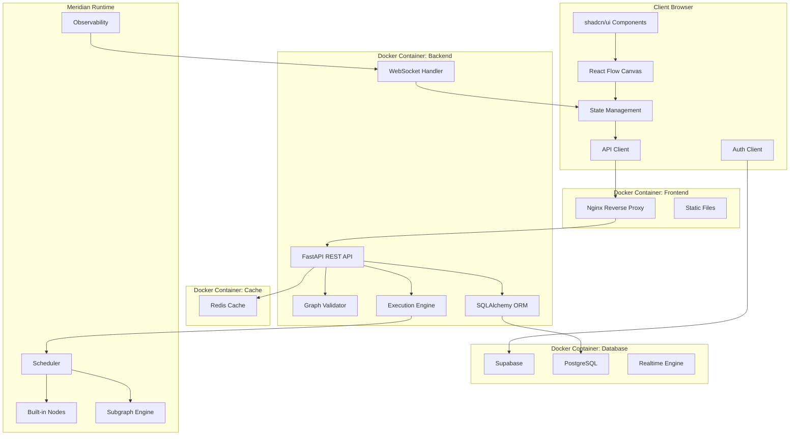

# Design Document

## Overview

**Meridian Studio** will be implemented as a modern full-stack application that provides an intuitive interface for creating, editing, and executing Meridian Runtime computational graphs. The system consists of a React-based frontend using React Flow for graph visualization and a FastAPI backend that interfaces with the Meridian Runtime engine installed from PyPI.

The architecture leverages the extensive Meridian built-in node library (40+ nodes) including DataProducer, MapTransformer, DataConsumer, Router, EventAggregator, AsyncWorker, ThrottleNode, CircuitBreakerNode, EncryptionNode, and many others, providing users with a comprehensive toolkit for building complex data processing workflows.

**Repository Structure**: Meridian Studio will be developed as a standalone repository (`meridian-studio`) separate from the meridian-runtime project, with modular code organization keeping all files under 200 lines of code for maintainability.

## Architecture

### High-Level Architecture



### Technology Stack

**Frontend:**
- **Deno 2 (default runtime)**: npm interop for Vite/React; Node optional
- **Vite**: Build tool and development server for fast hot reload
- **React 18**: UI framework with hooks and concurrent features
- **TypeScript**: Type safety and better developer experience
- **React Flow**: Node-based graph visualization and interaction
- **shadcn/ui**: Modern, accessible UI component library
- **Tailwind CSS**: Utility-first CSS framework
- **Zustand**: Lightweight state management
- **React Query**: Server state management and caching

**Backend:**
- **FastAPI**: Modern Python web framework with automatic OpenAPI docs
- **Pydantic**: Data validation and serialization
- **WebSockets**: Real-time communication for execution feedback
- **SQLAlchemy**: ORM for database operations
- **Alembic**: Database migrations
- **Uvicorn**: ASGI server for production deployment

**Database & Auth:**
- **PostgreSQL**: Primary database for graph storage and user data
- **Supabase**: Self-hosted for authentication, real-time subscriptions, and database management
- **Redis**: Session storage and caching (optional)

**Infrastructure:**
- **Docker**: Containerization for all services
- **Docker Compose**: Local development orchestration
- **Nginx**: Reverse proxy and static file serving
- **Deno Docker**: Frontend build stage uses `denoland/deno:2`

**Graph Engine:**
- **Meridian Runtime**: Core graph execution engine
- **Built-in Nodes**: Comprehensive library of pre-built processing nodes
- **Scheduler**: Fair cooperative scheduling with observability

## Components and Interfaces

### Frontend Components

#### 1. Graph Canvas Component
```typescript
interface GraphCanvasProps {
  nodes: Node[]
  edges: Edge[]
  onNodesChange: (changes: NodeChange[]) => void
  onEdgesChange: (changes: EdgeChange[]) => void
  onConnect: (connection: Connection) => void
  isExecuting: boolean
}
```

**Responsibilities:**
- Render the main graph visualization using React Flow
- Handle node dragging, selection, and positioning
- Manage edge connections with validation
- Display execution state with visual indicators
- Support zoom, pan, and canvas interactions

#### 2. Node Palette Component
```typescript
interface NodePaletteProps {
  nodeTypes: MeridianNodeType[]
  onNodeDrag: (nodeType: string) => void
  searchQuery: string
  onSearchChange: (query: string) => void
}
```

**Responsibilities:**
- Display categorized list of available Meridian nodes
- Support search and filtering of node types
- Enable drag-and-drop node creation
- Show node documentation and examples

#### 3. Properties Panel Component
```typescript
interface PropertiesPanelProps {
  selectedNode: GraphNode | null
  onPropertyChange: (nodeId: string, property: string, value: any) => void
  validationErrors: ValidationError[]
}
```

**Responsibilities:**
- Display and edit properties of selected nodes
- Render appropriate input controls based on property types
- Show validation errors and help text
- Support complex property types (objects, arrays, functions)

#### 4. Execution Control Component
```typescript
interface ExecutionControlProps {
  graphState: GraphExecutionState
  onExecute: () => void
  onStop: () => void
  onPause: () => void
  executionResults: ExecutionResults
}
```

**Responsibilities:**
- Provide controls for graph execution (start, stop, pause)
- Display execution status and progress
- Show real-time execution metrics
- Handle execution results and errors

#### 5. Message Trace Viewer Component
```typescript
interface MessageTraceViewerProps {
  selectedEdge: GraphEdge | null
  messageTrace: MessageTrace[]
  onMessageSelect: (messageId: string) => void
  isVisible: boolean
}
```

**Responsibilities:**
- Display detailed message trace for selected edges
- Show message payload, type, timestamp, and metadata
- Enable message selection for path tracing
- Support filtering and searching through message history

#### 6. Communication Analytics Component
```typescript
interface CommunicationAnalyticsProps {
  executionId: string
  realTimeMetrics: EdgeMetrics[]
  historicalData: ExecutionMetrics[]
  onTimeRangeChange: (range: TimeRange) => void
}
```

**Responsibilities:**
- Display real-time communication metrics and charts
- Show throughput, latency, and queue depth analytics
- Highlight bottlenecks and performance issues
- Enable historical comparison and analysis

#### 7. Message Flow Visualizer Component
```typescript
interface MessageFlowVisualizerProps {
  selectedMessage: Message | null
  messagePath: MessagePath
  graphNodes: GraphNode[]
  graphEdges: GraphEdge[]
  onPathHighlight: (path: string[]) => void
}
```

**Responsibilities:**
- Visualize complete message paths through the graph
- Highlight causal relationships between messages
- Show message transformations at each node
- Enable interactive path exploration

### Backend API Endpoints

#### 1. Graph Management API
```python
@router.post("/graphs")
async def create_graph(graph: GraphDefinition, current_user: User = Depends(get_current_user)) -> GraphResponse

@router.get("/graphs")
async def list_user_graphs(current_user: User = Depends(get_current_user)) -> List[GraphSummary]

@router.get("/graphs/{graph_id}")
async def get_graph(graph_id: str, current_user: User = Depends(get_current_user)) -> GraphResponse

@router.put("/graphs/{graph_id}")
async def update_graph(graph_id: str, graph: GraphDefinition, current_user: User = Depends(get_current_user)) -> GraphResponse

@router.delete("/graphs/{graph_id}")
async def delete_graph(graph_id: str, current_user: User = Depends(get_current_user)) -> StatusResponse

@router.post("/graphs/{graph_id}/share")
async def share_graph(graph_id: str, share_settings: ShareSettings, current_user: User = Depends(get_current_user)) -> ShareResponse
```

#### 2. Node Discovery API
```python
@router.get("/nodes/types")
async def get_node_types() -> List[NodeTypeDefinition]

@router.get("/nodes/types/{node_type}")
async def get_node_type_details(node_type: str) -> NodeTypeDefinition
```

#### 3. Graph Validation API
```python
@router.post("/graphs/validate")
async def validate_graph(graph: GraphDefinition) -> ValidationResponse

@router.post("/graphs/{graph_id}/validate")
async def validate_existing_graph(graph_id: str) -> ValidationResponse
```

#### 4. Graph Execution API
```python
@router.post("/graphs/{graph_id}/execute")
async def execute_graph(graph_id: str, params: ExecutionParams) -> ExecutionResponse

@router.get("/graphs/{graph_id}/execution/{execution_id}")
async def get_execution_status(graph_id: str, execution_id: str) -> ExecutionStatus

@router.post("/graphs/{graph_id}/execution/{execution_id}/stop")
async def stop_execution(graph_id: str, execution_id: str) -> StatusResponse
```

#### 5. WebSocket API
```python
@router.websocket("/ws/execution/{execution_id}")
async def execution_websocket(websocket: WebSocket, execution_id: str)
```

**WebSocket Message Types:**
- `execution_started`: Execution began
- `node_processing`: Node is currently processing
- `node_completed`: Node finished processing
- `edge_message`: Message passed through edge with payload and metadata
- `message_trace`: Detailed message trace with path information
- `communication_metrics`: Real-time edge metrics (throughput, latency, queue depth)
- `bottleneck_detected`: Performance warning for slow or blocked edges
- `execution_completed`: Execution finished
- `execution_error`: Execution encountered error
- `metrics_update`: Real-time metrics data

#### 6. Message Tracing API
```python
@router.get("/executions/{execution_id}/messages")
async def get_message_trace(execution_id: str, edge_id: str = None) -> List[MessageTrace]

@router.get("/executions/{execution_id}/messages/{message_id}/path")
async def get_message_path(execution_id: str, message_id: str) -> MessagePath

@router.get("/executions/{execution_id}/analytics")
async def get_communication_analytics(execution_id: str, time_range: str = "5m") -> CommunicationAnalytics
```

## Data Models

### Frontend Data Models

#### GraphNode
```typescript
interface GraphNode {
  id: string
  type: string // Meridian node type
  position: { x: number; y: number }
  data: {
    label: string
    properties: Record<string, any>
    inputs: PortDefinition[]
    outputs: PortDefinition[]
    status: 'idle' | 'processing' | 'completed' | 'error'
  }
}
```

#### GraphEdge
```typescript
interface GraphEdge {
  id: string
  source: string
  target: string
  sourceHandle: string
  targetHandle: string
  data: {
    capacity: number
    policy: 'block' | 'drop' | 'latest' | 'coalesce'
    priority: number
    messageCount: number
    status: 'idle' | 'active' | 'blocked' | 'bottleneck'
    realTimeMetrics: {
      throughput: number // messages per second
      latency: number // average processing time
      queueDepth: number // current queue size
      droppedMessages: number
    }
    messageTrace: MessageTrace[]
  }
}
```

#### MessageTrace
```typescript
interface MessageTrace {
  id: string
  timestamp: number
  type: 'DATA' | 'CONTROL' | 'ERROR'
  payload: any
  metadata: Record<string, any>
  sourceNode: string
  targetNode: string
  edgeId: string
  processingTime: number
  queueTime: number
}
```

#### MessagePath
```typescript
interface MessagePath {
  messageId: string
  path: Array<{
    nodeId: string
    edgeId: string
    timestamp: number
    transformation: any // what happened to the message at this node
  }>
  totalLatency: number
  bottlenecks: string[] // node or edge IDs where delays occurred
}
```

#### CommunicationAnalytics
```typescript
interface CommunicationAnalytics {
  executionId: string
  timeRange: string
  edgeMetrics: Array<{
    edgeId: string
    throughput: number[]
    latency: number[]
    queueDepth: number[]
    timestamps: number[]
  }>
  bottlenecks: Array<{
    location: string // node or edge ID
    severity: 'warning' | 'critical'
    description: string
    suggestions: string[]
  }>
  totalMessages: number
  averageLatency: number
  peakThroughput: number
}
```

#### MeridianNodeType
```typescript
interface MeridianNodeType {
  name: string
  category: string
  description: string
  inputs: PortDefinition[]
  outputs: PortDefinition[]
  properties: PropertyDefinition[]
  examples: string[]
  documentation: string
}
```

### Backend Data Models

#### GraphDefinition (Pydantic)
```python
class GraphDefinition(BaseModel):
    id: str
    name: str
    description: str
    nodes: List[NodeDefinition]
    edges: List[EdgeDefinition]
    metadata: Dict[str, Any] = {}
    user_id: str  # Owner of the graph
    is_public: bool = False  # Whether graph can be shared
    tags: List[str] = []  # For categorization
    created_at: datetime
    updated_at: datetime
```

#### NodeDefinition (Pydantic)
```python
class NodeDefinition(BaseModel):
    id: str
    type: str  # Meridian node class name
    name: str
    position: Position
    properties: Dict[str, Any] = {}
    
class Position(BaseModel):
    x: float
    y: float
```

#### EdgeDefinition (Pydantic)
```python
class EdgeDefinition(BaseModel):
    id: str
    source_node: str
    source_port: str
    target_node: str
    target_port: str
    capacity: int = 1024
    policy: EdgePolicy = EdgePolicy.BLOCK
    priority: int = 0

class MessageTrace(BaseModel):
    id: str
    timestamp: float
    type: MessageType
    payload: Any
    metadata: Dict[str, Any] = {}
    source_node: str
    target_node: str
    edge_id: str
    processing_time: float
    queue_time: float

class MessagePath(BaseModel):
    message_id: str
    path: List[MessagePathStep]
    total_latency: float
    bottlenecks: List[str]

class MessagePathStep(BaseModel):
    node_id: str
    edge_id: str
    timestamp: float
    transformation: Any

class EdgeMetrics(BaseModel):
    edge_id: str
    throughput: float
    latency: float
    queue_depth: int
    dropped_messages: int
    timestamp: float

class CommunicationAnalytics(BaseModel):
    execution_id: str
    time_range: str
    edge_metrics: List[EdgeMetrics]
    bottlenecks: List[BottleneckInfo]
    total_messages: int
    average_latency: float
    peak_throughput: float

class BottleneckInfo(BaseModel):
    location: str
    severity: str
    description: str
    suggestions: List[str]
```

## Error Handling

### Frontend Error Handling

1. **Network Errors**: Retry logic with exponential backoff
2. **Validation Errors**: Real-time display in properties panel
3. **Execution Errors**: Visual indicators on affected nodes
4. **Connection Errors**: WebSocket reconnection with state recovery

### Backend Error Handling

1. **Graph Validation Errors**: Detailed error messages with node/edge locations
2. **Execution Errors**: Structured error reporting with stack traces
3. **Node Configuration Errors**: Property-level validation with suggestions
4. **Runtime Errors**: Graceful degradation with partial results

### Error Response Format
```python
class ErrorResponse(BaseModel):
    error: str
    message: str
    details: Optional[Dict[str, Any]] = None
    location: Optional[str] = None  # node_id or edge_id
    suggestions: List[str] = []
```

## Testing Strategy

### Frontend Testing

#### Integration Tests (Primary Focus)
- Graph canvas interactions with real React Flow and state management
- Properties panel form validation with actual Meridian node schemas
- WebSocket message handling with real-time execution feedback
- Complete user workflows from graph creation to execution
- Authentication flows with actual Supabase integration

#### Component Tests (Minimal)
- Critical component behavior only when integration tests are insufficient
- Focus on testing real functionality over mocked interactions

#### Visual Testing
- Component visual regression tests
- Graph layout and rendering
- Responsive design across screen sizes

### Backend Testing

#### Integration Tests (Primary Focus)
- Full API workflow testing with real database operations
- WebSocket connection and messaging with actual execution
- Graph execution with real Meridian Runtime from PyPI
- Database operations with actual Supabase instance
- Authentication and authorization with real JWT tokens

#### Focused Component Tests (Minimal)
- Critical business logic only when integration tests don't cover edge cases
- Pydantic model validation for complex data structures

#### Performance Tests
- Graph execution performance
- WebSocket message throughput
- API response times under load
- Memory usage during large graph execution

### End-to-End Testing

#### User Journey Tests
- Create graph from scratch
- Load and modify existing graph
- Execute graph and view results
- Handle execution errors gracefully
- Save and share graph definitions

#### Browser Compatibility
- Chrome, Firefox, Safari, Edge
- Desktop and tablet form factors
- WebSocket support verification

## Implementation Phases

### Phase 1: Core Infrastructure
- Set up new `meridian-studio` repository with modular structure
- Create uv environment and install meridian-runtime from PyPI
- Set up Vite + React + TypeScript project with modular components (<200 LOC)
- Implement basic React Flow canvas
- Create FastAPI backend with modular endpoints (<200 LOC)
- Set up Meridian Runtime integration with PyPI package

> Branch prefixes: `feat/infra-scaffold`, `feat/frontend-core`, `feat/backend-core`

### Phase 2: Node Management
- Implement node palette with Meridian node discovery
- Add drag-and-drop node creation
- Create properties panel with dynamic forms
- Add basic graph validation

> Branch prefixes: `feat/node-discovery`, `feat/node-palette`, `feat/properties-panel`, `feat/graph-validation`

### Phase 3: Graph Execution
- Implement graph execution API
- Add WebSocket real-time updates
- Create execution control UI
- Add visual execution feedback

> Branch prefixes: `feat/execution-api-ws`, `feat/execution-control`, `feat/execution-telemetry`

### Phase 4: Advanced Features
- Add graph save/load functionality
- Implement advanced validation
- Add performance monitoring
- Create graph templates and examples

> Branch prefixes: `feat/graph-persistence`, `feat/advanced-validation`, `feat/perf-monitoring`, `feat/templates`

### Phase 5: Polish and Optimization
- Improve UI/UX based on testing
- Add comprehensive error handling
- Optimize performance
- Add documentation and help system

> Branch prefixes: `perf/optimizations`, `fix/error-handling`, `docs/site`

## Database Schema

### Core Tables

#### users
```sql
CREATE TABLE users (
    id UUID PRIMARY KEY DEFAULT gen_random_uuid(),
    email VARCHAR(255) UNIQUE NOT NULL,
    name VARCHAR(255),
    avatar_url TEXT,
    created_at TIMESTAMP WITH TIME ZONE DEFAULT NOW(),
    updated_at TIMESTAMP WITH TIME ZONE DEFAULT NOW()
);
```

#### graphs
```sql
CREATE TABLE graphs (
    id UUID PRIMARY KEY DEFAULT gen_random_uuid(),
    user_id UUID NOT NULL REFERENCES users(id) ON DELETE CASCADE,
    name VARCHAR(255) NOT NULL,
    description TEXT,
    definition JSONB NOT NULL, -- Complete graph definition
    is_public BOOLEAN DEFAULT FALSE,
    tags TEXT[] DEFAULT '{}',
    created_at TIMESTAMP WITH TIME ZONE DEFAULT NOW(),
    updated_at TIMESTAMP WITH TIME ZONE DEFAULT NOW()
);

CREATE INDEX idx_graphs_user_id ON graphs(user_id);
CREATE INDEX idx_graphs_tags ON graphs USING GIN(tags);
CREATE INDEX idx_graphs_public ON graphs(is_public) WHERE is_public = TRUE;
```

#### graph_executions
```sql
CREATE TABLE graph_executions (
    id UUID PRIMARY KEY DEFAULT gen_random_uuid(),
    graph_id UUID NOT NULL REFERENCES graphs(id) ON DELETE CASCADE,
    user_id UUID NOT NULL REFERENCES users(id) ON DELETE CASCADE,
    status VARCHAR(50) NOT NULL DEFAULT 'pending', -- pending, running, completed, failed
    started_at TIMESTAMP WITH TIME ZONE,
    completed_at TIMESTAMP WITH TIME ZONE,
    results JSONB,
    error_message TEXT,
    execution_metrics JSONB,
    communication_analytics JSONB, -- Real-time communication data
    created_at TIMESTAMP WITH TIME ZONE DEFAULT NOW()
);

CREATE INDEX idx_executions_graph_id ON graph_executions(graph_id);
CREATE INDEX idx_executions_user_id ON graph_executions(user_id);
CREATE INDEX idx_executions_status ON graph_executions(status);
```

#### message_traces
```sql
CREATE TABLE message_traces (
    id UUID PRIMARY KEY DEFAULT gen_random_uuid(),
    execution_id UUID NOT NULL REFERENCES graph_executions(id) ON DELETE CASCADE,
    message_id VARCHAR(255) NOT NULL,
    timestamp TIMESTAMP WITH TIME ZONE NOT NULL,
    message_type VARCHAR(20) NOT NULL, -- DATA, CONTROL, ERROR
    payload JSONB,
    metadata JSONB DEFAULT '{}',
    source_node VARCHAR(255) NOT NULL,
    target_node VARCHAR(255) NOT NULL,
    edge_id VARCHAR(255) NOT NULL,
    processing_time FLOAT DEFAULT 0,
    queue_time FLOAT DEFAULT 0,
    created_at TIMESTAMP WITH TIME ZONE DEFAULT NOW()
);

CREATE INDEX idx_message_traces_execution_id ON message_traces(execution_id);
CREATE INDEX idx_message_traces_message_id ON message_traces(message_id);
CREATE INDEX idx_message_traces_timestamp ON message_traces(timestamp);
CREATE INDEX idx_message_traces_edge_id ON message_traces(edge_id);
```

#### edge_metrics
```sql
CREATE TABLE edge_metrics (
    id UUID PRIMARY KEY DEFAULT gen_random_uuid(),
    execution_id UUID NOT NULL REFERENCES graph_executions(id) ON DELETE CASCADE,
    edge_id VARCHAR(255) NOT NULL,
    timestamp TIMESTAMP WITH TIME ZONE NOT NULL,
    throughput FLOAT DEFAULT 0, -- messages per second
    latency FLOAT DEFAULT 0, -- average processing time
    queue_depth INTEGER DEFAULT 0,
    dropped_messages INTEGER DEFAULT 0,
    created_at TIMESTAMP WITH TIME ZONE DEFAULT NOW()
);

CREATE INDEX idx_edge_metrics_execution_id ON edge_metrics(execution_id);
CREATE INDEX idx_edge_metrics_edge_id ON edge_metrics(edge_id);
CREATE INDEX idx_edge_metrics_timestamp ON edge_metrics(timestamp);
```

#### shared_graphs
```sql
CREATE TABLE shared_graphs (
    id UUID PRIMARY KEY DEFAULT gen_random_uuid(),
    graph_id UUID NOT NULL REFERENCES graphs(id) ON DELETE CASCADE,
    shared_by UUID NOT NULL REFERENCES users(id) ON DELETE CASCADE,
    shared_with UUID REFERENCES users(id) ON DELETE CASCADE, -- NULL for public shares
    permissions VARCHAR(50) NOT NULL DEFAULT 'read', -- read, write, execute
    expires_at TIMESTAMP WITH TIME ZONE,
    created_at TIMESTAMP WITH TIME ZONE DEFAULT NOW()
);

CREATE INDEX idx_shared_graphs_graph_id ON shared_graphs(graph_id);
CREATE INDEX idx_shared_graphs_shared_with ON shared_graphs(shared_with);
```

## Docker Configuration

### docker-compose.yml
```yaml
version: '3.8'

services:
  frontend:
    build:
      context: ./frontend
      dockerfile: Dockerfile
    ports:
      - "3000:80"
    depends_on:
      - backend
    environment:
      - VITE_API_URL=http://localhost:8000
      - VITE_SUPABASE_URL=http://localhost:54321
      - VITE_SUPABASE_ANON_KEY=${SUPABASE_ANON_KEY}

  backend:
    build:
      context: ./backend
      dockerfile: Dockerfile
    ports:
      - "8000:8000"
    depends_on:
      - db
      - redis
    environment:
      - DATABASE_URL=postgresql://postgres:postgres@db:5432/graph_builder
      - REDIS_URL=redis://redis:6379
      - SUPABASE_URL=http://supabase:54321
      - SUPABASE_SERVICE_KEY=${SUPABASE_SERVICE_KEY}
    volumes:
      - ./backend:/app
    command: uvicorn main:app --host 0.0.0.0 --port 8000 --reload

  db:
    image: supabase/postgres:15.1.0.117
    ports:
      - "54322:5432"
    environment:
      - POSTGRES_PASSWORD=postgres
      - POSTGRES_DB=graph_builder
    volumes:
      - postgres_data:/var/lib/postgresql/data
      - ./supabase/migrations:/docker-entrypoint-initdb.d

  supabase:
    image: supabase/supabase:latest
    ports:
      - "54321:8000"
    depends_on:
      - db
    environment:
      - DATABASE_URL=postgresql://postgres:postgres@db:5432/graph_builder
      - JWT_SECRET=${JWT_SECRET}
      - ANON_KEY=${SUPABASE_ANON_KEY}
      - SERVICE_ROLE_KEY=${SUPABASE_SERVICE_KEY}
    volumes:
      - ./supabase/config:/etc/supabase

  redis:
    image: redis:7-alpine
    ports:
      - "6379:6379"
    volumes:
      - redis_data:/data

volumes:
  postgres_data:
  redis_data:
```

## Authentication & Authorization

### Supabase Integration
- **Row Level Security (RLS)**: Ensure users can only access their own graphs
- **JWT Authentication**: Secure API endpoints with Supabase JWT tokens
- **Social Login**: Support Google, GitHub, and email/password authentication
- **Real-time Subscriptions**: Live updates when graphs are shared or modified

### Security Policies
```sql
-- Users can only see their own graphs
CREATE POLICY "Users can view own graphs" ON graphs
    FOR SELECT USING (auth.uid() = user_id);

-- Users can only modify their own graphs
CREATE POLICY "Users can modify own graphs" ON graphs
    FOR ALL USING (auth.uid() = user_id);

-- Users can view shared graphs
CREATE POLICY "Users can view shared graphs" ON graphs
    FOR SELECT USING (
        id IN (
            SELECT graph_id FROM shared_graphs 
            WHERE shared_with = auth.uid() OR shared_with IS NULL
        )
    );
```

## Meridian Runtime Integration & Feedback Loop

### Pain Point Collection Strategy

As Meridian Studio integrates with Meridian Runtime, we will systematically collect and document any issues, limitations, or improvement opportunities to feed back to the main Meridian Runtime repository.

#### Issue Tracking Categories

**1. API/Integration Issues**
- Missing or unclear documentation
- Inconsistent API behavior
- Type definition problems
- Import/export difficulties

**2. Node Discovery & Metadata**
- Incomplete node metadata extraction
- Missing property schema information
- Categorization challenges
- Documentation gaps

**3. Execution & Observability**
- Limited observability hooks
- Missing execution lifecycle events
- Insufficient error context
- Performance monitoring gaps

**4. Graph Validation**
- Validation rule inconsistencies
- Missing validation feedback
- Port compatibility edge cases
- Circular dependency detection issues

**5. Real-time Communication Tracing**
- Missing message interception points
- Insufficient metadata in messages
- Performance impact of tracing
- Limited path tracking capabilities

#### Feedback Collection Process

**During Development:**
```python
# Example: Issue tracking in code
class MeridianIssueTracker:
    def __init__(self):
        self.issues = []
    
    def log_issue(self, category: str, description: str, 
                  severity: str, context: dict = None):
        """Log issues encountered during Meridian Runtime integration"""
        issue = {
            'timestamp': datetime.now(),
            'category': category,
            'description': description,
            'severity': severity,  # 'low', 'medium', 'high', 'critical'
            'context': context or {},
            'meridian_version': get_meridian_version(),
            'studio_version': get_studio_version()
        }
        self.issues.append(issue)
        
    def export_issues(self) -> List[dict]:
        """Export issues for reporting to main repo"""
        return self.issues
```

**Issue Documentation Template:**
```markdown
## Meridian Runtime Issue Report

**Category:** [API/Node Discovery/Execution/Validation/Tracing]
**Severity:** [Low/Medium/High/Critical]
**Meridian Version:** [version]
**Studio Version:** [version]

### Description
[Clear description of the issue]

### Expected Behavior
[What should happen]

### Actual Behavior
[What actually happens]

### Reproduction Steps
1. [Step 1]
2. [Step 2]
3. [Step 3]

### Context
- Node types involved: [list]
- Graph complexity: [simple/medium/complex]
- Execution environment: [local/docker/production]

### Suggested Solution
[If applicable, suggest how this could be improved]

### Impact on Studio
[How this affects Meridian Studio functionality]
```

#### Automated Issue Collection

**Integration Points for Issue Detection:**
- Node type discovery failures
- Graph validation errors
- Execution monitoring gaps
- Message tracing limitations
- Performance bottlenecks
- Documentation inconsistencies

**Reporting Mechanism:**
- Automated issue collection during development
- Weekly issue summary reports
- Critical issue immediate escalation
- Community feedback integration

#### Improvement Opportunities Tracking

**Enhancement Requests:**
- Additional observability hooks needed
- Missing node metadata fields
- Performance optimization opportunities
- API consistency improvements
- Documentation enhancements

**Success Metrics:**
- Number of issues identified and resolved
- Improvement in integration experience
- Reduction in workarounds needed
- Enhanced observability capabilities

This feedback loop ensures that Meridian Studio not only benefits from Meridian Runtime but also contributes to making it better for the entire community.